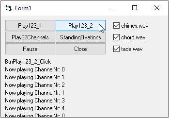

# Sound_MultiWaveOut
## Plays multiple wave-sounds at once.
Uses winmm.dll Win-API to play multiple wave-sounds at once, even if wav-header is different.
One wav-file "applause.wav" is included", chime, chord, and tada comes from windows\media-folder

